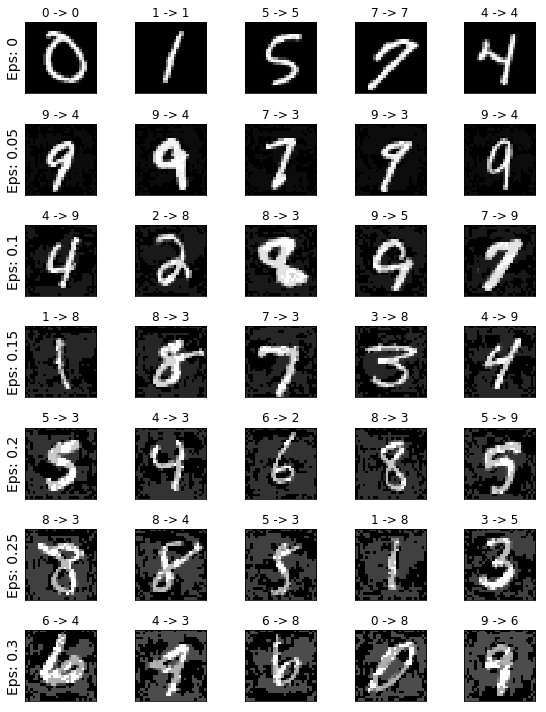

# Adverserial Network on MNIST

## Authors
* Mehdi Badreddine Ghouwati
* Youssef Achenchabe

The idea behind an Adverserial Network is to fool a trained model by slightly changing the input data. While being *almost* the same to the eye, the network has a hard time guessing it right. This Notebook is inspired by [this tutorial](https://pytorch.org/tutorials/beginner/fgsm_tutorial.html?fbclid=IwAR3hPRlJOTlcb8hPXExoc4kIwBP1JVvV10rb3kRbkHniUqzSCZAXNfqi7h4).

## The Model used
A very basic FC layer model over MNIST.

```python
class Model(nn.Module):
    def __init__(self):
        super(Model, self).__init__()
        self.fc = nn.Linear(784, 1000)
        self.fc2 = nn.Linear(1000, 10)

    def forward(self, x):
        x = x.view((-1, 784))
        h = F.relu(self.fc(x))
        h = self.fc2(h)
        return F.log_softmax(h, dim=1)    
```

## Accuracy of the model


## Fast Gradient Step Method - Attack

About the *Fast Gradient Attack Sign* :
The *Fast Gradient Attack Sign* is basically adding some noise, in the direction that maximizes the loss, everywhere on the pictures we are working on. The added noise must be The general formula is :
$$x_{attacked}=x_{raw}+\epsilon \nabla_{x}(J(\theta,x,y))$$.

And here is the function in python
 
```python 
def fgsm (image, epsilon, data_grad):
    # Collect the element-wise sign of the data gradient
    sign_data_grad = data_grad.sign()
    # Create the perturbed image by adjusting each pixel of the input image
    perturbed_image = image + epsilon*sign_data_grad
    # Adding clipping to maintain [0,1] range
    perturbed_image = torch.clamp(perturbed_image, 0, 1)
    # Return the perturbed image
    return perturbed_image
```

## Test phase
Since the model we want to attack is already trained we apply the *fgsm* over the testset and we see how the model does under the attack.


## Result

The accuracy drops 


Some examples of wrong predictions :


